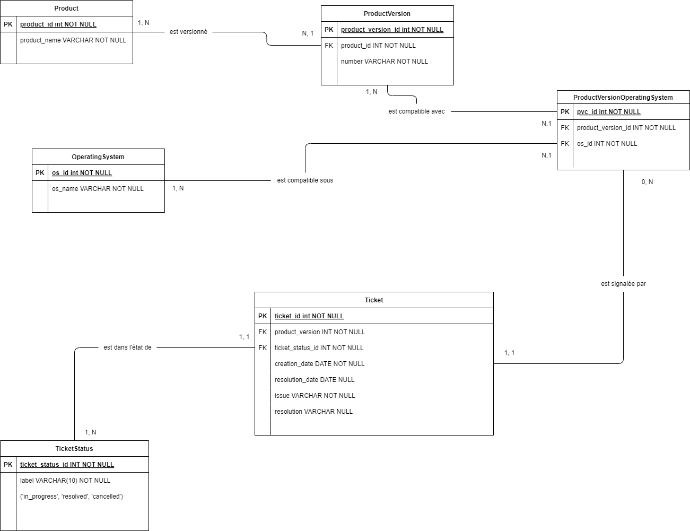

# Projet 6 — Modélisez et créez une base de données pour une application .NET

## Présentation

Ce projet consiste à modéliser une base de données pour la gestion de tickets d’application, à l’exploiter via des requêtes LINQ optimisées, et à livrer une sauvegarde complète de la base.  

---

## Fichiers du projet

- **Le diagramme entité–association du projet** : 
- **Dossier `/Projet_6/Models/Entities/`** : Contient les entités EF Core (`Ticket`, `Product`, `OperatingSystem`, etc.)
- **Dossier `/Projet_6/Data/`** : Contient l'AppDbContext qui initialise la bdd.
- **Dossier `/Projet_6_Queries/`** : Contient toutes les requêtes LINQ optimisées + leur fichier MyExtensions.
- **Dossier `/Projet_6_Backup/`** : Contient la sauvegarde intégrale de la base de données (`aspnet-Projet_6.bak`)

---

## Utilisation des requêtes LINQ

- Toutes les requêtes principales du projet sont regroupées en une requête paramétrable via la méthode d’extension `ApplyFilters`.  
- Pour chaque requête demandée, les paramètres sont ajustés. Il existe 10 formes de requêtes pour les 20 requêtes demandées.
- Sur LINQPad, la methode d'extension "ApplyFliters" doit être ajoutée au fichier global "MyExtensions" local par un copier/coller.

## Pour restaurer la base de données

- Ouvrir SSMS > clic droit sur “Bases de données” > “Restaurer une base de données...”

- Sélectionner le fichier .bak fourni.

- Suivre l’assistant de restauration.
